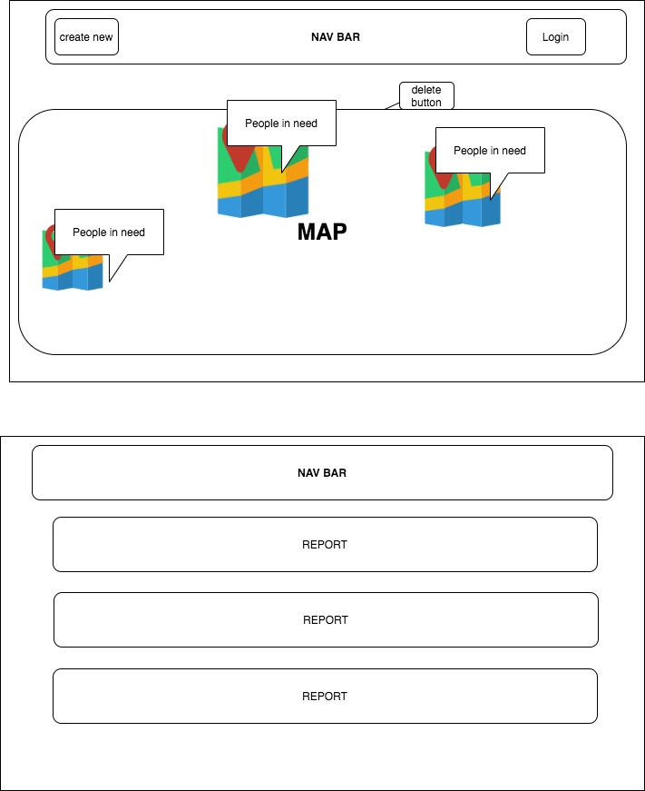

# Support Website 
In this website you can use google map to add mark up of your location where others can give help and support to your problem.

## User story 
* As user I shall be able create mark up in the map
* As user I  shall be able to edit my place
* As user I shall be able to show detail view 
* As user I shall be able to delete place
* As user I shall be able to create report Issue
* As user I shall be able to edit report
* As user I shall be able to show detail view of the report view 
* As user I shall be able to create comment inside the show detail view 
* As user I shall be able to delete report 

## Wireframe

## Mockup
#### Report page

#### Detail view for report

#### Map and points mark up

## Entity Relationship diagram

## Technology Used
* Ruby and Rails
* Postgresql
* Javascript
* HTML
* CSS
* Developer Tool
* Sass
* Google map API 